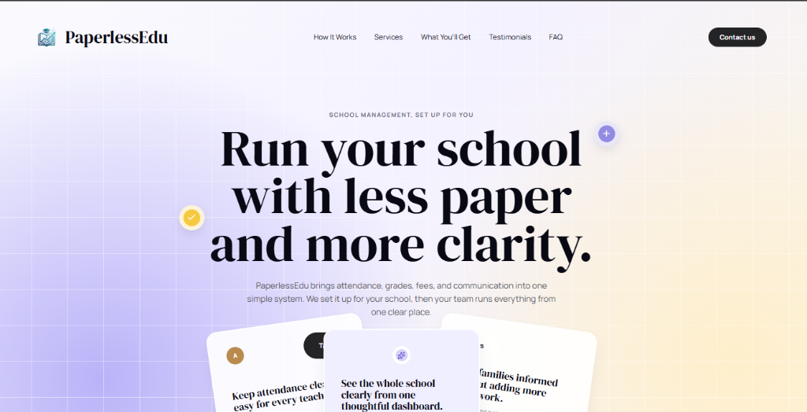

# PaperlessEdu

> Run your school with less paper and more clarity.

A purpose-built, single-tenant school management platform engineered to eliminate paperwork bottlenecks for primary and secondary schools. PaperlessEdu unifies daily attendance, continuous assessment gradebooks, automated terminal report cards, school fee billing, and parent communication into a clear, reliable system.



---

## Table of Contents

- [Overview](#overview)
- [Architecture & Deployment Model](#architecture--deployment-model)
- [Core System Modules](#core-system-modules)
- [Live Deployment & Preview](#live-deployment--preview)
- [Tech Stack](#tech-stack)
- [Project Directory Structure](#project-directory-structure)
- [Getting Started & Local Setup](#getting-started--local-setup)
  - [Prerequisites](#prerequisites)
  - [Installation Steps](#installation-steps)
  - [Running the Development Server](#running-the-development-server)
- [Automated Static Export & CI/CD](#automated-static-export--cicd)
- [Testing & Quality Assurance](#testing--quality-assurance)
- [Security & OWASP Compliance](#security--owasp-compliance)
- [Contributing](#contributing)
- [License & Support](#license--support)

---

## Overview

PaperlessEdu replaces fragmented paper registers, handwritten report cards, and disconnected spreadsheets with an integrated, secure digital workspace. 

Rather than functioning as an impersonal multi-tenant SaaS application, PaperlessEdu follows an **onboarding-partnered model**:
- Every school receives its own dedicated database instance.
- System configurations (grading scales, term calendars, class hierarchies, and crest branding) are tailored to each institution.
- On-site onboarding, staff workshops, and historical record digitization are provided during deployment.

---

## Architecture & Deployment Model

- **Single-Tenant Database Isolation**: Each school institution operates within its own completely isolated environment. Student records, financial receipts, and academic grades are never co-mingled in a multi-tenant shared table.
- **Low-Bandwidth Optimization**: Engineered specifically to withstand unstable or slow campus internet connections. Lightweight server-rendered pages and client asset caching keep administrative operations responsive on basic laptops and mobile devices.
- **Dual-Mode Delivery**:
  - **Dynamic Backend**: Full Django application powering authentication, role permissions, transactional fee payments, and report compilation.
  - **Static Showcase & Feedback Portal**: Automated GitHub Actions compilation generating static HTML/CSS artifacts for public demonstrations and stakeholder review on GitHub Pages.

---

## Core System Modules

### 1. Student Records & Admissions
Centralized digital profiles tracking student bio-data, guardian contact trees, emergency medical records, admission histories, and class assignments.

### 2. Daily & Period Attendance
Roll call taken in seconds from smartphones, tablets, or desktop browsers. Instantly generates campus-wide absentee rosters and provides automated notifications to guardians.

### 3. Continuous Assessment & Gradebook
Customizable weighted scoring for classroom exercises, term projects, mid-term examinations, and final terminal exams. Features automated position computation and GPA/grading scale calculations.

### 4. Instant Report Card PDF Engine
Produces whole-class terminal report card booklets with a single click, styled with the school's official crest, watermark, performance legend, and customized headteacher remarks.

### 5. School Fees & Tamper-Evident Receipts
Tracks term billings, scholarship deductions, installment payments, and outstanding arrears. Generates sequential, tamper-evident digital receipts for board financial audits.

### 6. Automated Parent SMS & Broadcast Alerts
Integrated direct messaging for fee reminders, emergency announcements, PTA meeting notices, and end-of-term academic progress notifications.

---

## Live Deployment & Preview

The static demonstration and feedback preview of the public landing page is hosted on GitHub Pages:

- **Live URL**: `https://anim-michael-asante.github.io/PaperlessEdu/`
- **Mobile Optimized**: Responsive across 375px (iPhone SE), 390px (iPhone 13/14), 768px (iPad), 1280px (laptop), and 1920px (desktop) viewports.

---

## Tech Stack

| Layer | Technology |
| --- | --- |
| Backend Framework | Django 6.0 |
| Runtime | Python 3.12 / 3.13 |
| Database | SQLite (Development) / PostgreSQL (Production) |
| Frontend | Semantic HTML5, Vanilla CSS3 (Custom Design System tokens) |
| Icons | Lucide Icons |
| Typography | Google Fonts (`DM Serif Display`, `Manrope`) |
| CI/CD Pipeline | GitHub Actions (`.github/workflows/static.yml`) |
| Static Export | Custom Python RequestFactory Compiler (`export_static.py`) |

---

## Project Directory Structure

```text
PaperlessEdu/
├── .github/
│   └── workflows/
│       └── static.yml          # GitHub Pages automated CI/CD pipeline
├── docs/
│   └── hero-preview.png        # Hero section visual documentation
├── paperlessedu/               # Django project root
│   ├── manage.py
│   ├── paperlessedu/           # Core settings, WSGI/ASGI configuration
│   ├── accounts/               # Authentication, user roles & staff permissions
│   ├── students/               # Student bio-data, enrollment, guardians
│   ├── academics/              # Classes, subjects, terms, academic years
│   ├── attendance/             # Daily and period roll call tracking
│   ├── grading/                # Continuous assessment, score sheets, report cards
│   ├── finance/                # Invoices, fee collection, audit receipts
│   ├── notifications/          # SMS dispatch, email templates, broadcast logs
│   ├── library/                # Book catalog, lending logs
│   └── core/                   # Public showcase, layouts, templates, and static assets
│       ├── static/core/        # CSS, brand logos, favicons, webmanifest
│       ├── templates/core/     # welcome.html and shared partials
│       └── tests.py            # Automated test suite
├── export_static.py            # Static compilation pipeline for GitHub Pages
├── requirements.txt            # Pinned dependencies
├── documentation.md            # Comprehensive system & architectural documentation
├── implementation-plan.md      # Architectural roadmap
├── SECURITY.md                 # Security disclosure & OWASP guidelines
└── README.md                   # Project overview & quickstart guide
```

---

## Getting Started & Local Setup

### Prerequisites

- Python 3.12 or higher
- Git
- Modern web browser

### Installation Steps

1. **Clone the repository**:
   ```bash
   git clone https://github.com/anim-michael-asante/PaperlessEdu.git
   cd PaperlessEdu
   ```

2. **Create and activate a virtual environment**:
   ```bash
   # On Windows (PowerShell)
   python -m venv .venv
   .\.venv\Scripts\Activate.ps1

   # On macOS / Linux
   python3 -m venv .venv
   source .venv/bin/activate
   ```

3. **Install dependencies**:
   ```bash
   pip install -r requirements.txt
   ```

4. **Run database migrations**:
   ```bash
   cd paperlessedu
   python manage.py migrate
   ```

### Running the Development Server

Start the local server from the `paperlessedu` directory:
```bash
python manage.py runserver
```

Open `http://127.0.0.1:8000/` in your browser to view the application.

---

## Automated Static Export & CI/CD

To generate a standalone static distribution of the public landing page:

```bash
# From project root
python export_static.py _site
```

The script:
1. Renders the Django `welcome` view in-memory via `RequestFactory`.
2. Automatically converts absolute static asset references into relative `./static/core/...` paths.
3. Bundles favicons, `site.webmanifest`, OpenGraph assets, and `.nojekyll`.
4. Outputs the compiled distribution into the `_site/` directory ready for deployment.

When code is pushed to the `main` branch, `.github/workflows/static.yml` executes this build process automatically and deploys the latest version to GitHub Pages.

---

## Testing & Quality Assurance

Run the automated test suite across all modules:

```bash
cd paperlessedu
python manage.py test
```

All 10 test suites covering route availability, template rendering, security headers, and static asset references must pass before deployment.

---

## Security & OWASP Compliance

PaperlessEdu enforces security-first design patterns:

- **A01: Broken Access Control**: Strict role verification across academic, teacher, and bursar portals.
- **A02: Cryptographic Failures**: Passwords hashed using Argon2/bcrypt; HTTPS enforced across all environments.
- **A03: Injection**: Django ORM parameterized queries exclusively; no raw concatenated SQL.
- **A04: Insecure Design**: Server-side business logic validation on all marks, attendance logs, and fee entries.
- **A05: Security Misconfiguration**: Debug mode disabled in production; directory browsing blocked.
- **A07: Identification and Authentication Failures**: Rate-limiting on authentication endpoints; session invalidation on logout.

Detailed security protocols and vulnerability disclosure instructions can be found in [`SECURITY.md`](SECURITY.md).

---

## Contributing

1. Fork the repository.
2. Create a feature branch (`git checkout -b feature/module-enhancement`).
3. Verify all tests pass (`python manage.py test`).
4. Commit your changes with clear, semantic messages (`git commit -m "feat: add terminal report remarks validation"`).
5. Push to your branch (`git push origin feature/module-enhancement`).
6. Open a Pull Request.

---

## License & Support

Distributed under the MIT License. See [`LICENSE.md`](LICENSE.md) for more details.

For school onboarding inquiries, demonstration bookings, or technical support, contact:
- **Email**: `hello@paperlessedu.com`
- **Security**: `security@paperlessedu.com`
